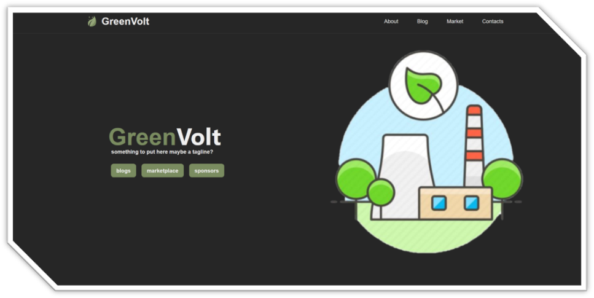
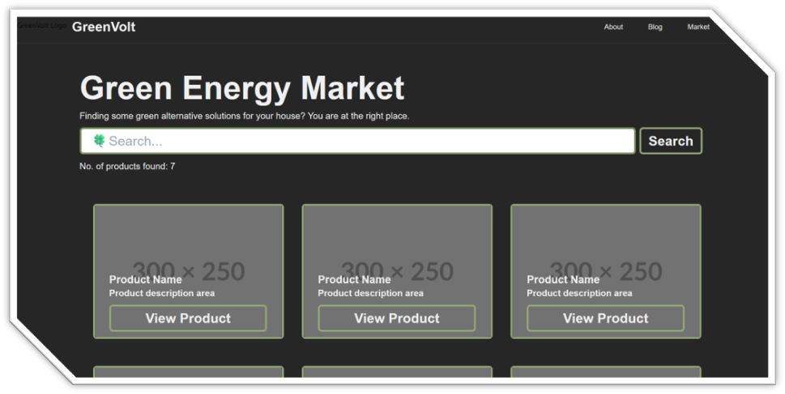
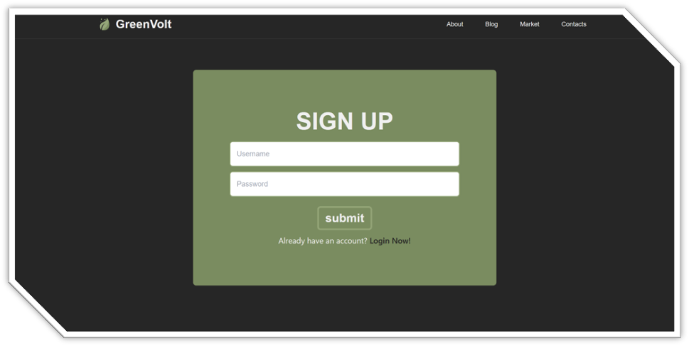

# Green Energy Adoption

## Statement
Encourage the adoption of renewable energy sources and promote energy efficiency to reduce carbon emissions.

## Summary
Develop a solution that educates individuals and organizations about the benefits of renewable energy, provides resources for transitioning to green energy sources, and offers tools for monitoring and optimizing energy usage.

## Deliverables
Create an online platform or mobile app that offers information on renewable energy technologies, connects users with local green energy providers and incentives, provides energy consumption tracking and optimization tools, and showcases success stories of organizations that have successfully transitioned to renewable energy sources.

## Screenshots

Landing page

Mobile view

Marketplace page

Signup page

Code screenshot
